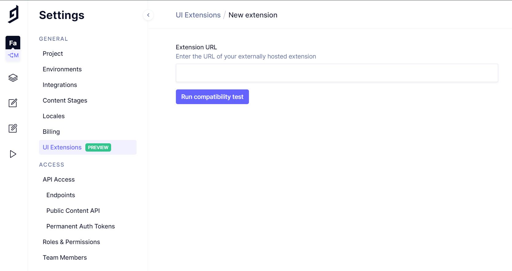
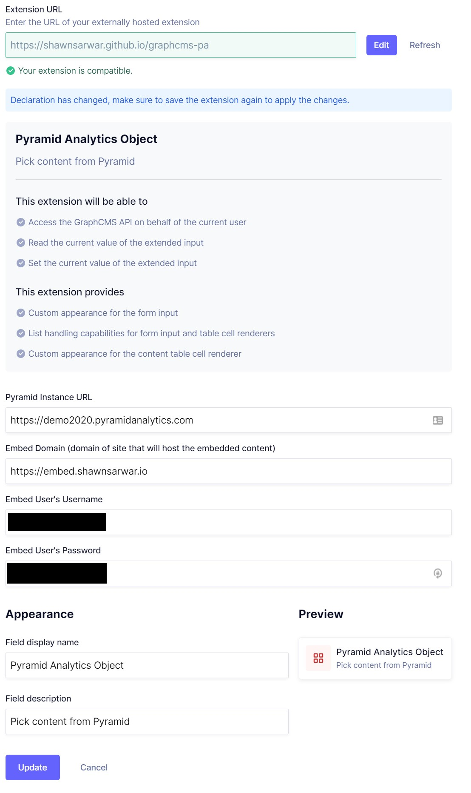
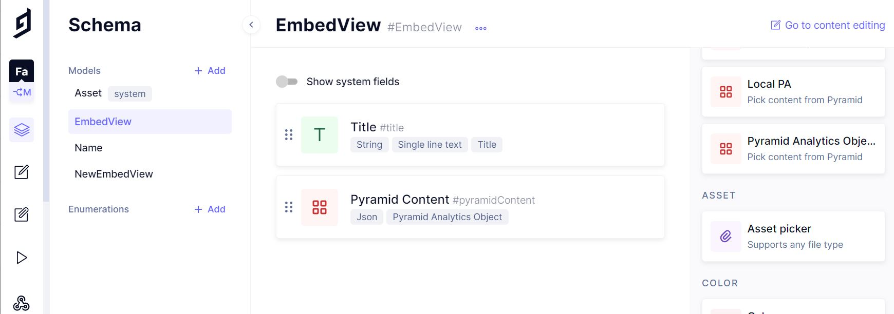
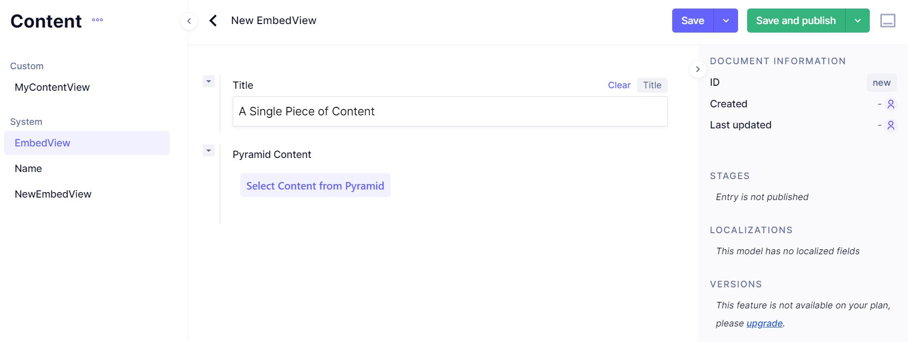
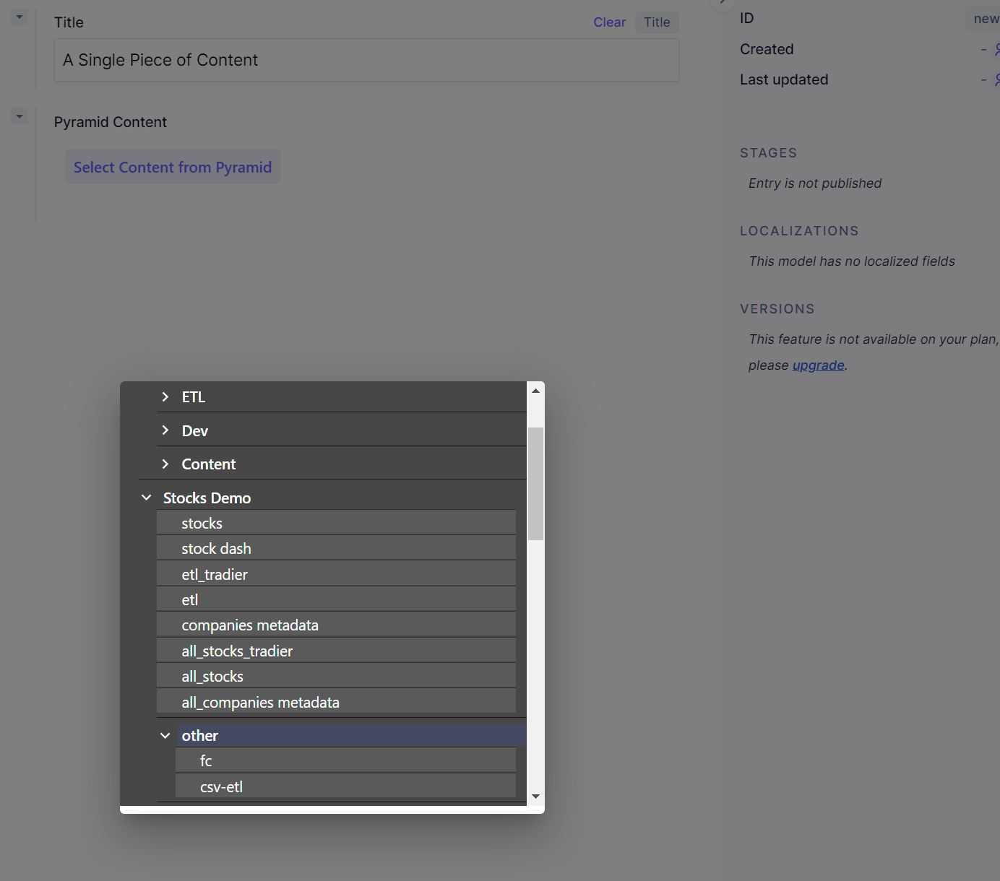
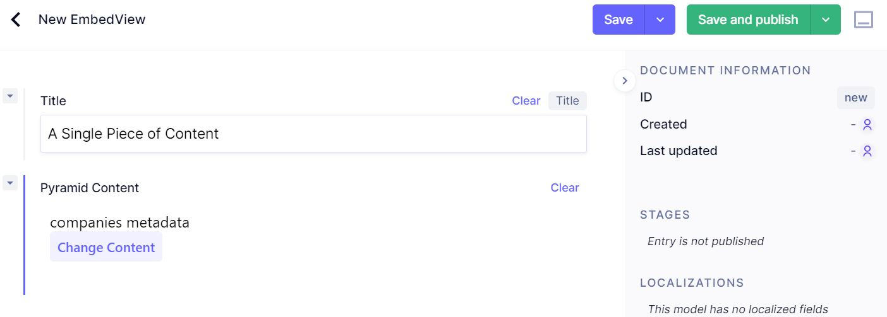
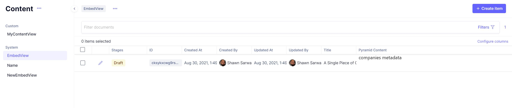

### GraphCMS Pyramid Analytics Plugin.

This plugin allows you to connect your GCMS instance to a single user on a Pyramid instance for the purpose of later embedding content into webpages.

#### *A Note on Embed Security*

Since GraphCMS does not hide credentials from administrators, and their credential will be used by everyone who is creating embeds, this "Embed User" in Pyramid should be a viewer in their own group. Content should be explicitly shared _to_ this user when it's ready for publication as embeds. Assume this user is insecure and only allow them access to public content since the embed_token will allow embedded access to all of their content.

#### Installation





#### Usage






```json
{
	"id": "cksykxcwg9rs50b98qlmym64m",
	"stage": "DRAFT",
	"updatedAt": "2021-08-30T11:49:46.833766+00:00",
	"createdAt": "2021-08-30T11:49:46.833766+00:00",
	"publishedAt": null,
	"publishedBy": null,
	"pyramidContent": {
		"url": "https://demo2020.pyramidanalytics.com",
		"contentID": "99016871-89e7-42e1-b567-f0193c53266a",
		"description": "companies metadata",
		"embed_token": "{The embed token would be here here}",
        "embed_domain": "https://embedsite.my-organization.net"
	},
	"title": "A Single Piece of Content",
	"createdBy": {
		"entryId": "cksh7lukx10yr01xldv2tawh1",
		"name": "Shawn Sarwar",
		"picture": "https://lh3.googleusercontent.com/a-/AOh14GioAbR58q1k0ZYnOT9lJz7D0cJ2rbCF6zRmERr6JHE=s96-c",
		"kind": "MEMBER",
		"isActive": true
	},
	"updatedBy": {
		"entryId": "cksh7lukx10yr01xldv2tawh1",
		"name": "Shawn Sarwar",
		"picture": "https://lh3.googleusercontent.com/a-/AOh14GioAbR58q1k0ZYnOT9lJz7D0cJ2rbCF6zRmERr6JHE=s96-c",
		"kind": "MEMBER",
		"isActive": true
	},
	"documentInStages": [{
		"id": "cksykxcwg9rs50b98qlmym64m",
		"stage": "DRAFT",
		"updatedAt": "2021-08-30T11:49:46.833766+00:00",
		"publishedAt": null
	}]
}
```

#### Rendering Saved Embeds

The schema for the "embed object" which will be saved in the CMS is:
```typescript
    {
        "url": String,          // The URL of the Pyramid Server
		"contentID": String     // The ID of the selected Content to be Embedded
		"description": String   // A Friendly Name for the content as defined on the Pyramid Server
		"embed_token": String   // A Copy of the embed token used to access the content
        "embed_domain": String  // The Domain from which this embed *must* be served
    }
```
Since GraphCMS is headless, you'll need to render the embed yourself. You *may only* embed on the domain that you set as your "Embed Domain" in your plugin settings.

Using the [Pyramid Embed Library](https://help.pyramidanalytics.com/Content/Root/developer/reference/Extensibility/Embedding/embed%20API/PyramidEmbedClient/pyramidEmbedClient.htm?tocpath=Tech%20Reference%7CExtensibility%7CEmbedding%7CEmbed%20API%7CPyramidEmbedClient%7C_____0) it should be as simple as:

```javascript
    var client = new PyramidEmbedClient(obj.url);
    var embedElement = document.getElementById("MyEmbedTargetLocationID");
    client.setAuthToken(obj.embed_token);
    client.init();
    client.setAuthFailureCallback(onErr)
    client.embed(
        embedElement,
        {
            contentId: obj.contentID,
        }
    );

```